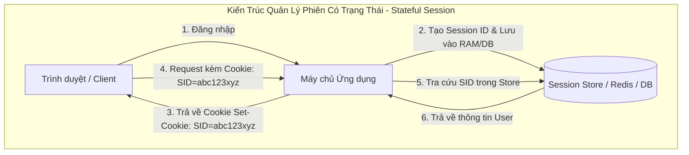
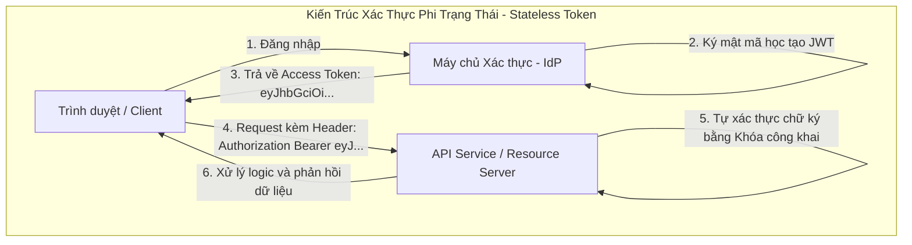
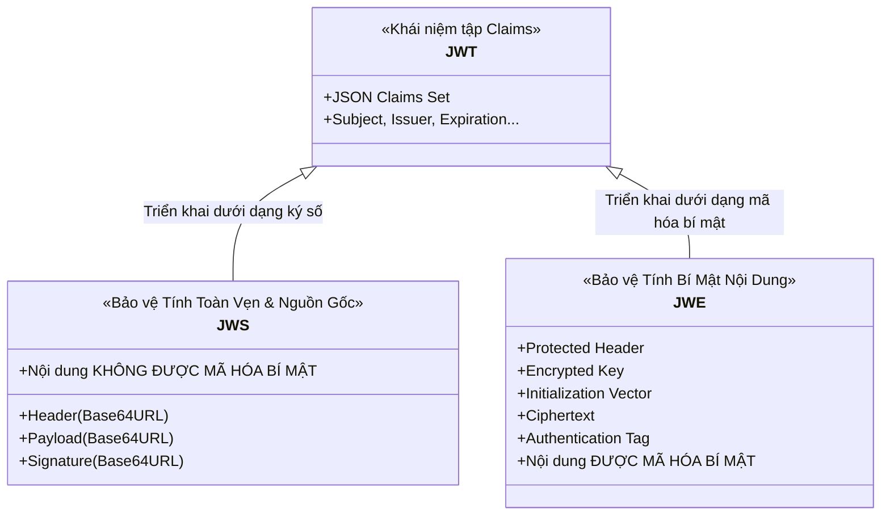

# Chương 1: Tổng Quan và Kiến Trúc Xác Thực

Trong kiến trúc phần mềm phân tán hiện đại, việc quản lý danh tính và phân quyền người dùng là một trong những bài toán nền tảng. Sự chuyển dịch từ các ứng dụng đơn khối (Monolithic) sang kiến trúc Microservices và ứng dụng phân tán đa nền tảng (Web, Mobile, IoT) đã thúc đẩy sự ra đời của các chuẩn xác thực phi trạng thái (Stateless Authentication).

---

## 1. Sự Tiến Hóa: Stateful Session vs Stateless Token

Để hiểu rõ lý do JWT ra đời, cần phân tích hai mô hình quản lý phiên làm việc chính trong lịch sử phát triển web.

### Bảng so sánh Stateful Session và Stateless Token

| Tiêu chí | Stateful Session (Cookie-based) | Stateless Token (JWT-based) |
| :--- | :--- | :--- |
| **Lưu trữ trạng thái phía Server** | Bắt buộc (Server RAM, Redis Cluster hoặc Database). | Không (Server không cần lưu trạng thái phiên của Client). |
| **Khả năng mở rộng ngang (Horizontal Scaling)** | Khó khăn. Yêu cầu cấu hình Sticky Session hoặc hệ thống Session Store tập trung có độ trễ thấp. | Cực kỳ linh hoạt. Mọi máy chủ API độc lập đều có thể tự xác thực token. |
| **Hỗ trợ Cross-Domain & Đa nền tảng** | Bị giới hạn bởi chính sách CORS/Cookie của trình duyệt; khó triển khai trên ứng dụng Mobile bản địa và IoT. | Rất thuận tiện. Token được gửi qua HTTP Header `Authorization: Bearer <token>`. |
| **Thu hồi quyền tức thì (Revocation)** | Dễ dàng. Chỉ cần xóa bản ghi Session trong Session Store. | Phức tạp. Cần kết hợp mô hình Access Token ngắn hạn và Token Blacklist. |
| **Kích thước gói tin truyền tải** | Rất nhỏ (chuỗi Session ID khoảng 32–64 bytes). | Lớn hơn (từ vài trăm bytes đến vài kilobytes do chứa đầy đủ Claims). |

---

## 2. JSON Web Token (JWT) Là Gì?

Theo định nghĩa tại **RFC 7519**:

> **JSON Web Token (JWT)** là một phương thức nhỏ gọn (compact), an toàn URL (URL-safe) dùng để biểu diễn các xác nhận (claims) được chuyển giao giữa hai bên tham gia. Các xác nhận trong JWT được mã hóa dưới dạng một đối tượng JSON và được bảo vệ toàn vẹn bằng chữ ký số (JSON Web Signature - JWS) hoặc mã hóa bí mật (JSON Web Encryption - JWE).

### Đặc tính cốt lõi của JWT

- **Tự chứa (Self-contained)**: Bản thân token đã chứa đầy đủ thông tin về định danh người dùng (`sub`), thời gian hết hạn (`exp`), quyền hạn (`roles`/`scopes`) và các siêu dữ liệu khác. Máy chủ API nhận được token có thể xử lý logic phân quyền ngay lập tức mà không cần truy vấn ngược lại cơ sở dữ liệu xác thực.
- **Nhỏ gọn (Compact)**: Được biểu diễn dưới dạng chuỗi các ký tự Base64URL nối với nhau bằng dấu chấm (`.`), có thể dễ dàng truyền tải qua tham số URL, trường HTTP Header hoặc phần thân HTTP POST.
- **Bảo toàn tính toàn vẹn (Integrity-protected)**: Dữ liệu được bảo vệ bằng chữ ký mật mã học. Bất kỳ sự thay đổi trái phép nào đối với Header hoặc Payload đều sẽ làm cho chữ ký không còn hợp lệ.

---

## 3. Phân Biệt Bản Chất: JWT, JWS và JWE

Trong thực tế, nhiều lập trình viên thường đồng nhất thuật ngữ "JWT" với chuỗi token 3 phần có chữ ký. Tuy nhiên, theo tiêu chuẩn JOSE, cần phân biệt rõ ràng:

### 1. JSON Web Token (JWT - RFC 7519)

JWT là một đặc tả trừu tượng mô tả cấu trúc tập hợp các xác nhận JSON (JSON Claims Set). Bản thân đặc tả JWT không tự quy định thuật toán toán học để ký hay mã hóa, mà nó ủy quyền việc này cho JWS và JWE.

### 2. JSON Web Signature (JWS - RFC 7515)

JWS là định dạng phổ biến nhất của JWT trong thực tế.

- **Cấu trúc**: Gồm 3 phần nối nhau bởi dấu chấm: `Header.Payload.Signature`.
- **Mục tiêu**: Đảm bảo **tính toàn vẹn (Integrity)** và **xác thực nguồn gốc (Authenticity)**.
- **Lưu ý an ninh đặc biệt quan trọng**: Dữ liệu Payload trong JWS **chỉ được mã hóa dạng biểu diễn Base64URL chứ KHÔNG ĐƯỢC MÃ HÓA BÍ MẬT (Not Encrypted)**. Bất kỳ ai bắt được token đều có thể giải mã Base64URL để đọc toàn bộ nội dung JSON bên trong. Do đó, tuyệt đối không lưu mật khẩu, khóa bí mật hoặc thông tin cá nhân nhạy cảm trong JWS Payload.

### 3. JSON Web Encryption (JWE - RFC 7516)

JWE được sử dụng khi cần đảm bảo **tính bí mật (Confidentiality)** của dữ liệu truyền tải.

- **Cấu trúc**: Gồm 5 phần nối nhau bởi dấu chấm: `Protected Header.Encrypted Key.IV.Ciphertext.Authentication Tag`.
- **Mục tiêu**: Mã hóa toàn bộ dữ liệu Payload sao cho chỉ bên nắm giữ khóa giải mã (Private Key hoặc Shared Secret) mới có thể đọc được nội dung gốc.

---

## 4. Đánh Giá Ưu Điểm và Nhược Điểm Khi Triển Khai JWT

### Ưu điểm

1. **Hiệu năng và Khả năng mở rộng cao**: Giảm tải hàng triệu truy vấn kiểm tra phiên làm việc đến cơ sở dữ liệu trung tâm, giúp hệ sinh thái Microservices mở rộng độc lập dễ dàng.
2. **Hỗ trợ kiến trúc đa dịch vụ (Federated Identity & SSO)**: Cho phép một máy chủ Identity Provider (như Keycloak, Auth0, Okta) cấp token để người dùng truy cập vào hàng trăm ứng dụng và dịch vụ khác nhau.
3. **Thân thiện với di động**: Dễ dàng tích hợp với ứng dụng iOS/Android thông qua Authorization Bearer Header mà không gặp phải rào cản chính sách Cookie của trình duyệt.

### Nhược điểm và Thách thức kỹ thuật

1. **Không thể thu hồi token ngay lập tức theo cách tự nhiên (Revocation Problem)**: Một khi JWT đã được ban hành, nó sẽ có hiệu lực cho đến khi chạm mốc `exp`. Việc xây dựng cơ chế thu hồi (Blacklist/Blocklist) sẽ đưa yếu tố trạng thái (State) quay trở lại hệ thống.
2. **Kích thước Header gia tăng (Overhead)**: Mỗi HTTP Request đều phải đính kèm chuỗi token dài từ vài trăm đến hàng nghìn ký tự, gây tiêu tốn thêm băng thông mạng.
3. **Nguy cơ rò rỉ dữ liệu khi cấu hình sai**: Do Payload chỉ là Base64URL, việc thiếu hiểu biết có thể dẫn đến việc lộ lọt dữ liệu nhạy cảm của người dùng.
