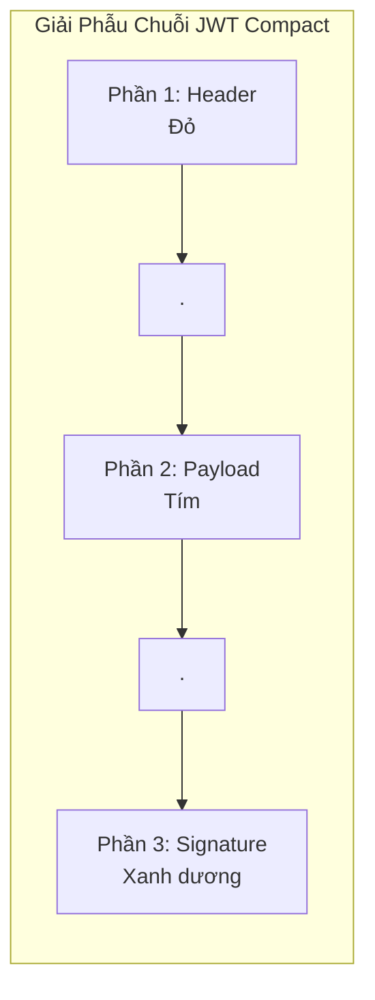
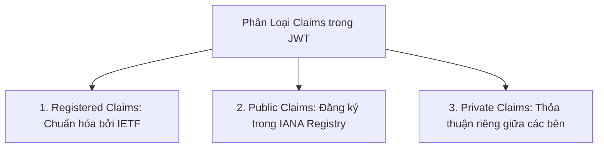
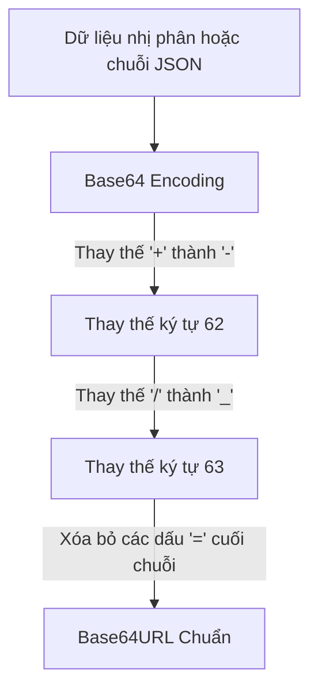

# Chương 2: Cấu Trúc Phân Đoạn và Mã Hóa Base64URL

Chuẩn JSON Web Signature (JWS Compact Serialization - RFC 7515) quy định cấu trúc của một chuỗi JWT bao gồm đúng 3 phân đoạn được phân tách bằng dấu chấm (`.`):

$$\text{JWT} = \text{Base64URL}(\text{Header}) \mathbin{\Vert} \text{"."} \mathbin{\Vert} \text{Base64URL}(\text{Payload}) \mathbin{\Vert} \text{"."} \mathbin{\Vert} \text{Base64URL}(\text{Signature})$$



---

## 1. Phân Đoạn 1: JOSE Header (Tiêu Đề)

Header là một đối tượng JSON chứa các siêu dữ liệu mô tả thuật toán mật mã học và loại token đang được sử dụng.

### Ví dụ JSON Header

```json
{
  "alg": "RS256",
  "typ": "JWT",
  "kid": "auth-service-key-2026-01"
}
```

### Các tham số tiêu chuẩn trong JOSE Header (RFC 7515 & RFC 7519)

| Tham số | Tên đầy đủ | Ý nghĩa kỹ thuật |
| :--- | :--- | :--- |
| `alg` | Algorithm | **Bắt buộc**. Xác định thuật toán dùng để tạo và xác thực chữ ký (ví dụ: `HS256`, `RS256`, `ES256`, `EdDSA`, hoặc `none`). |
| `typ` | Type | **Khuyến nghị**. Loại đối tượng media type. Thường mang giá trị `"JWT"` hoặc `"at+jwt"` (RFC 9068 cho Access Token). |
| `kid` | Key ID | **Khuyến nghị trong môi trường xoay khóa**. Chuỗi định danh gợi ý khóa nào trong danh sách JWKS được dùng để ký token này. |
| `cty` | Content Type | Sử dụng khi token được lồng nhau (Nested JWT - ví dụ JWT nằm trong JWE). |
| `crit` | Critical | Mảng chứa danh sách các phần tử header mở rộng mà trình xác thực bắt buộc phải hiểu và xử lý. |
| `jku` | JWK Set URL | Đường dẫn URL trỏ đến tập tài nguyên JWKS công khai của bên ký. |
| `jwk` | JSON Web Key | Nhúng trực tiếp Khóa công khai dưới dạng JSON Web Key vào Header. |
| `x5u` | X.509 URL | Đường dẫn URL trỏ đến chuỗi chứng chỉ số X.509. |
| `x5t#S256` | X.509 Thumbprint SHA-256 | Giá trị băm SHA-256 của chứng chỉ số X.509 tương ứng. |

---

## 2. Phân Đoạn 2: JWT Claims Set (Payload / Nội Dung)

Payload là đối tượng JSON chứa các xác nhận (Claims). Claims là những khẳng định về một thực thể (thường là người dùng hoặc dịch vụ) cùng các siêu dữ liệu bổ trợ.

RFC 7519 phân loại Claims thành 3 nhóm rõ ràng:



### 2.1. Các Claims Đã Được Đăng Ký (Registered Claims - RFC 7519 Section 4.1)

Đây là các trường tiêu chuẩn đã được định nghĩa sẵn, không bắt buộc nhưng được khuyến nghị sử dụng để đảm bảo tính tương thích giữa các hệ thống:

| Claim | Tên đầy đủ | Kiểu dữ liệu | Ý nghĩa kỹ thuật |
| :--- | :--- | :--- | :--- |
| `iss` | Issuer | String / URI | Xác định bên ban hành token (ví dụ: `https://auth.company.com`). |
| `sub` | Subject | String | Chủ thể định danh của token (ví dụ: User ID `usr_991283`). |
| `aud` | Audience | String / Array | Đối tượng nhận token hợp lệ (ví dụ: `https://api.company.com`). |
| `exp` | Expiration Time | NumericDate (Unix timestamp) | **Thời điểm hết hạn**. Token sẽ bị từ chối nếu thời gian hiện tại $\ge$ `exp`. |
| `nbf` | Not Before | NumericDate (Unix timestamp) | **Thời điểm bắt đầu có hiệu lực**. Token sẽ bị từ chối nếu thời gian hiện tại $<$ `nbf`. |
| `iat` | Issued At | NumericDate (Unix timestamp) | Thời điểm token được tạo ra. |
| `jti` | JWT ID | String | Mã định danh duy nhất của token, thường dùng để chống tấn công Replay hoặc làm khóa thu hồi (Blacklist). |

*Lưu ý về `NumericDate`*: Là số nguyên hoặc số thực biểu diễn số giây tính từ mốc Unix Epoch (`1970-01-01T00:00:00Z UTC`), bỏ qua giây nhuận.

### 2.2. Public Claims

Các claims do các tổ chức hoặc cộng đồng định nghĩa thêm nhưng cần đăng ký trong [IANA JSON Web Token Registry](https://www.iana.org/assignments/jwt/jwt.xhtml) hoặc sử dụng tên miền tránh xung đột (Collision-Resistant Namespaces như `https://example.com/claims/department`).

### 2.3. Private Claims

Các claims tùy biến được tạo ra dựa trên sự thống nhất nội bộ giữa nhà cung cấp dịch vụ và người tiêu thụ token (ví dụ: `roles`, `permissions`, `tenant_id`, `email`).

---

## 3. Bản Chất Của Mã Hóa Base64URL (RFC 4648 Section 5)

Một sự nhầm lẫn phổ biến là coi Base64 thông thường và Base64URL là một. Việc hiểu sai điểm này là nguyên nhân hàng đầu gây lỗi giải mã trên các hệ thống tích hợp.

### 3.1. Bảng So Sánh Base64 Chuẩn vs Base64URL

| Đặc tính | Base64 Tiêu Chuẩn (RFC 4648 §4) | Base64URL (RFC 4648 §5) |
| :--- | :--- | :--- |
| **Ký tự thứ 62 (chỉ số 62)** | Ký tự cộng `+` (ASCII `0x2B`) | Ký tự gạch ngang `-` (ASCII `0x2D`) |
| **Ký tự thứ 63 (chỉ số 63)** | Ký tự gạch chéo `/` (ASCII `0x2F`) | Ký tự gạch dưới `_` (ASCII `0x5F`) |
| **Ký tự đệm (Padding)** | Bắt buộc đệm bằng dấu bằng `=` (`%3D`) | **Loại bỏ hoàn toàn** ký tự đệm `=` |
| **Tính tương thích URL** | Kém (ký tự `+`, `/`, `=` bị encode trong URL query/path) | Hoàn toàn an toàn khi truyền qua URL, HTTP Header, Cookie |



---

## 4. Công Thức Toán Học Tạo Chữ Ký (Signature Construction)

Chữ ký số trong JWS được tạo ra bằng cách áp dụng thuật toán mật mã học $S$ (xác định bởi `alg` trong Header) với Khóa ký $K$ (Private Key hoặc Secret Key) lên chuỗi **Signing Input**:

$$\text{Signing Input} = \text{ASCII}(\text{Base64URL}(\text{Header})) \mathbin{\Vert} \text{"."} \mathbin{\Vert} \text{ASCII}(\text{Base64URL}(\text{Payload}))$$

$$\text{Raw Signature} = \text{Sign}_{K, \text{alg}}(\text{Signing Input})$$

$$\text{Final Signature Segment} = \text{Base64URL}(\text{Raw Signature})$$

### Quy trình xác thực chữ ký phía Người nhận (Verifier)

1. Tách chuỗi JWT thành 3 phần: $H_{b64}$, $P_{b64}$, $S_{b64}$.
2. Giải mã $H_{b64}$ để đọc Header, xác định thuật toán `alg` và mã định danh khóa `kid`.
3. Tái lập chuỗi đầu vào ký: $M = H_{b64} \mathbin{\Vert} \text{"."} \mathbin{\Vert} P_{b64}$.
4. Giải mã $S_{b64}$ từ Base64URL thành chuỗi byte chữ ký thô $S_{raw}$.
5. Sử dụng Khóa xác thực tương ứng $K_{pub}$ để thực hiện kiểm tra:
   $$\text{Verify}_{K_{pub}, \text{alg}}(M, S_{raw}) \stackrel{?}{=} \text{TRUE}$$
6. Nếu kết quả là TRUE, tiến hành kiểm tra các claims nghiệp vụ (`exp`, `nbf`, `iss`, `aud`).
