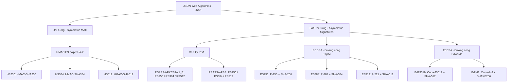
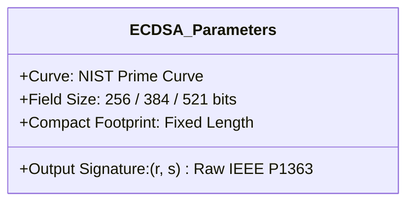

# Chương 3: Các Thuật Toán Ký Số JSON Web Algorithms (JWA) - RFC 7518 & RFC 8037

JSON Web Algorithms (JWA) được định nghĩa tại RFC 7518 và mở rộng bởi RFC 8037, chuẩn hóa danh mục các thuật toán mật mã học sử dụng trong hệ sinh thái JOSE để ký số (Signature), mã hóa khóa (Key Encryption) và mã hóa dữ liệu (Content Encryption).

Chương này tập trung chuyên sâu vào các thuật toán chữ ký số (Digital Signatures) và mã xác thực thông điệp (Message Authentication Codes - MAC) được sử dụng trong JWS/JWT.



---

## 1. Nhóm Thuật Toán Đối Xứng: HMAC-SHA (HS256, HS384, HS512)

### 1.1. Nguyên lý hoạt động

HMAC (Hash-based Message Authentication Code - RFC 2104) sử dụng một hàm băm mật mã học $H$ kết hợp với một khóa bí mật $K$ (Secret Key) để xác thực tính toàn vẹn và nguồn gốc thông điệp.

Công thức toán học của HMAC:
$$\text{HMAC}(K, M) = H\Big((K' \oplus \text{opad}) \mathbin{\Vert} H\big((K' \oplus \text{ipad}) \mathbin{\Vert} M\big)\Big)$$

Trong đó:

- $K'$: Khóa sau khi được chuẩn hóa về độ dài khối (block size) của hàm băm (nếu $K$ dài hơn block size, $K' = H(K)$; nếu $K$ ngắn hơn, thêm các byte 0x00 vào cuối).
- $\text{ipad}$ (inner pad): Byte `0x36` lặp lại theo độ dài khối (64 bytes cho SHA-256, 128 bytes cho SHA-384/SHA-512).
- $\text{opad}$ (outer pad): Byte `0x5C` lặp lại theo độ dài khối.
- $\Vert$: Phép nối chuỗi byte (Concatenation).
- $\oplus$: Phép toán XOR bitwise.
- $M$: Dữ liệu cần ký, chính là `ASCII(Base64URL(Header) || "." || Base64URL(Payload))`.

### 1.2. Các biến thể trong JWA

- **HS256**: HMAC sử dụng hàm băm SHA-256. Độ dài chữ ký đầu ra: 256 bits (32 bytes).
- **HS384**: HMAC sử dụng hàm băm SHA-384. Độ dài chữ ký đầu ra: 384 bits (48 bytes).
- **HS512**: HMAC sử dụng hàm băm SHA-512. Độ dài chữ ký đầu ra: 512 bits (64 bytes).

### 1.3. Yêu cầu bắt buộc về độ dài khóa (Key Size Requirements)

Theo RFC 7518 Section 3.2:

- Khóa bí mật cho HS256 **BẮT BUỘC** phải có độ dài tối thiểu 256 bits (32 bytes).
- Khóa cho HS384 phải có độ dài tối thiểu 384 bits (48 bytes).
- Khóa cho HS512 phải có độ dài tối thiểu 512 bits (64 bytes).

Việc sử dụng khóa bí mật quá ngắn (ví dụ chuỗi password đơn giản 8-10 ký tự) sẽ khiến token dễ dàng bị bẻ khóa ngoại tuyến (Offline Brute-force) bằng GPU hoặc tấn công từ điển (Dictionary Attack).

---

## 2. Nhóm Thuật Toán Bất Đối Xứng RSA

RSA (Rivest-Shamir-Adleman) sử dụng cặp khóa bất đối xứng: Khóa bí mật (Private Key) dùng để tạo chữ ký và Khóa công khai (Public Key) dùng để xác thực chữ ký.

### 2.1. RSASSA-PKCS1-v1_5 (RS256, RS384, RS512)

RSASSA-PKCS1-v1_5 là cơ chế chữ ký số cổ điển được chuẩn hóa trong RFC 8017 (PKCS #1 v2.2).

- **Quy trình ký**:
  1. Tính giá trị băm $H(M)$ của chuỗi signing input.
  2. Đóng gói giá trị băm theo cấu trúc ASN.1 `DigestInfo` gồm thông tin OID của thuật toán băm và giá trị băm.
  3. Thực hiện đệm dữ liệu có tính xác định (deterministic padding) theo chuẩn PKCS#1 v1.5:
     $$\text{EM} = \text{0x00} \mathbin{\Vert} \text{0x01} \mathbin{\Vert} \text{PS} \mathbin{\Vert} \text{0x00} \mathbin{\Vert} T$$
     Trong đó $\text{PS}$ là chuỗi các byte `0xFF` để độ dài $\text{EM}$ bằng đúng độ dài khóa RSA.
  4. Tính chữ ký: $S = \text{EM}^d \pmod n$.

- **Nhược điểm**:
  Cơ chế đệm PKCS#1 v1.5 mang tính xác định (deterministic - không chứa yếu tố ngẫu nhiên). Mặc dù chữ ký RSA-PKCS1-v1.5 trong JWT chưa bị phá vỡ toàn diện nếu cài đặt cẩn thận, nhưng việc thiếu yếu tố ngẫu nhiên làm giảm biên độ an toàn toán học trước các biến thể tấn công kênh phụ so với RSA-PSS.

### 2.2. RSASSA-PSS (PS256, PS384, PS512)

RSASSA-PSS (Probabilistic Signature Scheme - RFC 8017) là cơ chế chữ ký RSA hiện đại được khuyến nghị thay thế cho PKCS1-v1.5.

- **Đặc điểm nổi bật**:
  - Sử dụng hàm tạo mặt nạ Mask Generation Function (MGF1) kết hợp với muối ngẫu nhiên (Salt).
  - Tính chất xác suất (Probabilistic): Mỗi lần ký cùng một thông điệp sẽ tạo ra một chữ ký hoàn toàn khác nhau nhưng đều xác thực hợp lệ bởi cùng một Public Key.
  - Có bằng chứng chứng minh an toàn mật mã học chặt chẽ hơn trong mô hình Random Oracle Model.

---

## 3. Nhóm Thuật Toán Đường Cong Elliptic: ECDSA (ES256, ES384, ES512)

ECDSA (Elliptic Curve Digital Signature Algorithm - ANSI X9.62, FIPS 186-4) cung cấp mức độ bảo mật tương đương RSA nhưng với kích thước khóa và kích thước chữ ký nhỏ hơn rất nhiều.



### 3.1. Các đường cong chuẩn NIST trong JWA

- **ES256**: Đường cong `P-256` (secp256r1) kết hợp SHA-256.
- **ES384**: Đường cong `P-384` (secp384r1) kết hợp SHA-384.
- **ES512**: Đường cong `P-521` (secp521r1) kết hợp SHA-512 (Lưu ý: 521 bits, không phải 512 bits).

### 3.2. Định dạng chữ ký: IEEE P1363 vs ASN.1 DER (Điểm đặc biệt quan trọng trong JWT)

Một chữ ký ECDSA về mặt toán học là một cặp số nguyên $(r, s)$.

- **Chuẩn ASN.1 DER (Dùng trong X.509, OpenSSL, TLS)**:
  Chữ ký được đóng gói theo cấu trúc SEQUENCE gồm 2 INTEGER:
  `SEQUENCE { r INTEGER, s INTEGER }`. Độ dài biến thiên (thường từ 70 đến 72 bytes cho P-256).
- **Chuẩn IEEE P1363 (BẮT BUỘC trong JWA - RFC 7518 Section 3.4)**:
  Chữ ký trong JWT phải là chuỗi byte thô (raw concatenated bytes) của $r$ và $s$, được chèn số 0 ở đầu (zero-padded) để đạt độ dài cố định tương ứng với đường cong:
  $$\text{Signature} = \text{Bytes}(r)_{[N]} \mathbin{\Vert} \text{Bytes}(s)_{[N]}$$

| Thuật toán | Đường cong | Độ dài $r$ (bytes) | Độ dài $s$ (bytes) | Tổng độ dài chữ ký JWS thô (bytes) | Độ dài Base64URL |
| :--- | :--- | :--- | :--- | :--- | :--- |
| **ES256** | P-256 | 32 | 32 | 64 | 86–88 ký tự |
| **ES384** | P-384 | 48 | 48 | 96 | 128 ký tự |
| **ES512** | P-521 | 66 | 66 | 132 | 176 ký tự |

*Lưu ý về ES512*: Đường cong P-521 có độ dài tọa độ là 521 bits, cần $\lceil 521 / 8 \rceil = 66$ bytes để biểu diễn. Tổng độ dài chữ ký là $66 + 66 = 132$ bytes.

---

## 4. Nhóm Thuật Toán Edwards-curve: EdDSA (Ed25519 & Ed448 - RFC 8037)

EdDSA (Edwards-curve Digital Signature Algorithm - RFC 8032) là thế hệ thuật toán chữ ký mới nhất được tích hợp vào JOSE thông qua RFC 8037.

### 4.1. Ưu điểm vượt trội của Ed25519

1. **Miễn nhiễm với Tấn công Kênh phụ (Side-Channel Attacks)**: Không sử dụng phép chia hoặc các nhánh rẽ điều kiện (conditional branches) phụ thuộc vào dữ liệu bí mật, giúp chống lại tấn công đo lường thời gian (Timing Attacks) ngay từ thiết kế gốc.
2. **Chữ ký có tính xác định an toàn (Deterministic Signatures)**: Không cần bộ sinh số ngẫu nhiên bí mật $k$ tại thời điểm ký (nguyên nhân từng làm lộ khóa bí mật trong các hệ thống dùng ECDSA kém an toàn như vụ tấn công máy chơi game Sony PS3).
3. **Hiệu năng vượt trội**: Tốc độ tạo và xác thực chữ ký nhanh gấp 2–3 lần so với ECDSA và nhanh gấp hàng chục lần so với RSA.
4. **Kích thước chữ ký tối ưu**: Chữ ký Ed25519 luôn cố định đúng 64 bytes.

### 4.2. Khai báo trong Header JWT

Trong JWS, EdDSA được khai báo tổng quát với `alg: "EdDSA"` trong Header, còn thông tin đường cong cụ thể (`crv: "Ed25519"` hoặc `crv: "Ed448"`) được xác định thông qua JWK của khóa.

```json
{
  "alg": "EdDSA",
  "typ": "JWT",
  "kid": "ed25519-key-2026"
}
```

---

## 5. Bảng So Sánh Toàn Diện Các Thuật Toán JWA

| Tiêu chí | HMAC (HS256) | RSA PKCS#1 (RS256) | RSA-PSS (PS256) | ECDSA (ES256) | EdDSA (Ed25519) |
| :--- | :--- | :--- | :--- | :--- | :--- |
| **Loại khóa** | Đối xứng (Symmetric) | Bất đối xứng | Bất đối xứng | Bất đối xứng | Bất đối xứng |
| **Kích thước khóa tiêu chuẩn** | $\ge 256$ bits | 2048 – 4096 bits | 2048 – 4096 bits | 256 bits | 256 bits |
| **Kích thước chữ ký** | 32 bytes | 256 – 512 bytes | 256 – 512 bytes | 64 bytes (IEEE P1363) | 64 bytes |
| **Tốc độ tạo chữ ký (Sign)** | Rất nhanh | Chậm | Chậm | Nhanh | Cực nhanh |
| **Tốc độ xác thực (Verify)** | Rất nhanh | Rất nhanh | Rất nhanh | Trung bình | Cực nhanh |
| **Khả năng phân phối khóa** | Kém (Bắt buộc chia sẻ bí mật) | Rất tốt (Công khai Public Key) | Rất tốt (Công khai Public Key) | Rất tốt (Công khai Public Key) | Rất tốt (Công khai Public Key) |
| **Chống Side-Channel Attack** | Phụ thuộc hàm so sánh | Cần cẩn trọng khi cài đặt | Tốt hơn PKCS#1 | Rủi ro nếu nonce $k$ kém | Miễn nhiễm theo thiết kế gốc |
| **Khuyến nghị sử dụng** | Microservices nội bộ | Hệ thống cũ (Legacy) | Cần tương thích RSA | Ứng dụng di động hiện đại | Hệ thống thế hệ mới (Khuyến nghị cao) |

---

## 6. Hướng Dẫn Lựa Chọn Thuật Toán Trong Thiết Kế Hệ Thống

1. **Khi nào nên dùng HMAC (HS256/HS384/HS512)?**
   - Hệ thống kiến trúc Monolith hoặc các Microservices nội bộ hoàn toàn tin cậy lẫn nhau, quản lý chung Secret Key qua Vault / Secret Manager.
   - Hệ thống yêu cầu thông lượng cực lớn (ultra-high throughput), độ trễ cực thấp và không cần chia sẻ quyền xác thực cho bên thứ ba.

2. **Khi nào nên dùng RSA (RS256 / PS256)?**
   - Hệ thống cần tương thích ngược với các thư viện cũ hoặc các hệ thống định danh doanh nghiệp (Enterprise Identity Providers như Keycloak, Okta, Active Directory).
   - **Ưu tiên `PS256`** nếu tất cả các bên tham gia đều hỗ trợ RFC 8017.

3. **Khi nào nên dùng ECDSA (ES256)?**
   - Ứng dụng Di động, IoT, Single Page Apps (SPA) nơi băng thông mạng và độ dài HTTP Header cần được tối ưu tối đa.
   - Chuẩn OpenID Connect hiện đại.

4. **Khi nào nên dùng EdDSA (Ed25519)?**
   - Các kiến trúc Microservices hiện đại phát triển mới, hệ thống phân tán yêu cầu hiệu năng cao nhất, mức độ bảo mật tối đa và khả năng chống rò rỉ kênh phụ tốt nhất.
