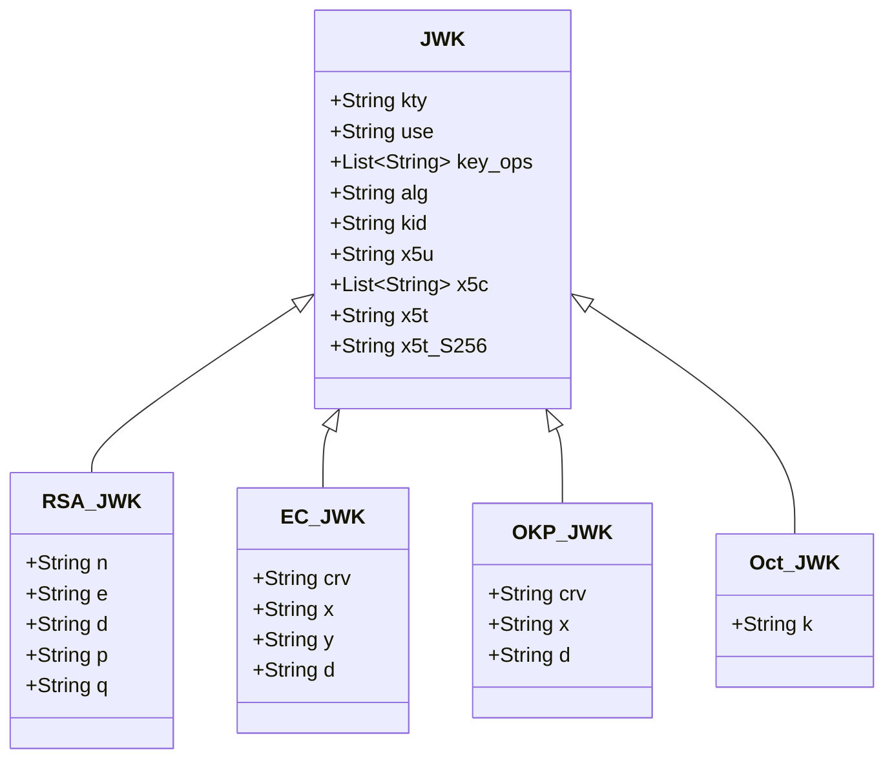
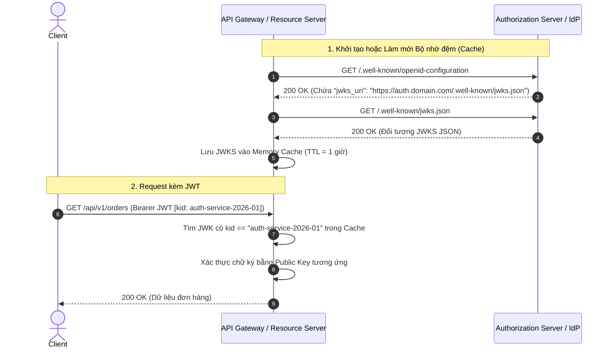
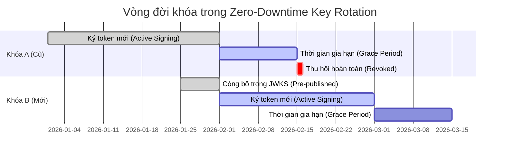

# Chương 4: Tiêu Chuẩn JSON Web Key (JWK) và JWKS - RFC 7517

JSON Web Key (JWK) được định nghĩa tại RFC 7517 là một cấu trúc dữ liệu JSON tiêu chuẩn hóa dùng để biểu diễn các khóa mật mã học (Cryptographic Keys).

JSON Web Key Set (JWKS) là một đối tượng JSON chứa tập hợp các JWK, đóng vai trò cốt lõi trong cơ chế quản lý, phân phối và xoay vòng khóa (Key Rotation) tự động trong các hệ sinh thái OpenID Connect (OIDC) và OAuth 2.0.

---

## 1. Cấu Trúc Tổng Quan Của JSON Web Key (JWK)

Mỗi JWK là một đối tượng JSON chứa các tham số xác định loại khóa, thuật toán sử dụng, định danh khóa và các giá trị tọa độ hoặc modulus mật mã học.



### 1.1. Các tham số dùng chung (Generic Parameters)

| Tham số | Kiểu dữ liệu | Mô tả kỹ thuật |
| :--- | :--- | :--- |
| `kty` | String (Bắt buộc) | **Key Type**: Xác định loại khóa mật mã học. Ví dụ: `RSA`, `EC`, `OKP`, `oct`. |
| `use` | String (Tùy chọn) | **Public Key Use**: Mục đích sử dụng khóa. Giá trị tiêu chuẩn: `sig` (Chữ ký / Xác thực) hoặc `enc` (Mã hóa). |
| `key_ops` | Array of Strings | **Key Operations**: Chi tiết các thao tác được phép (ví dụ: `["sign", "verify"]`, `["encrypt", "decrypt"]`). Không nên dùng đồng thời với `use`. |
| `alg` | String (Tùy chọn) | **Algorithm**: Thuật toán được chỉ định cho khóa này (ví dụ: `RS256`, `ES256`, `EdDSA`). |
| `kid` | String (Khuyến nghị) | **Key ID**: Mã định danh duy nhất của khóa trong một Key Set, dùng để khớp với `kid` trong JWT Header. |
| `x5c` | Array of Strings | **X.509 Certificate Chain**: Chuỗi chứng chỉ số X.509 mã hóa Base64 DER. |
| `x5t#S256` | String | **X.509 Certificate SHA-256 Thumbprint**: Giá trị băm SHA-256 Base64URL của chứng chỉ X.509. |

---

## 2. Định Dạng Chi Tiết Theo Từng Loại Khóa Mật Mã

### 2.1. Khóa RSA (`kty: "RSA"`)

Khóa RSA biểu diễn modulus $n$ và số mũ công khai $e$ (tất cả đều được mã hóa dạng Base64URL big-endian unsigned integers).

**Ví dụ Public RSA JWK:**

```json
{
  "kty": "RSA",
  "use": "sig",
  "alg": "RS256",
  "kid": "auth-rsa-key-01",
  "n": "u1WKErNOHG17Bi7ADqCAoWnFZ86JuFOHxwXgwUh40V24M45NXO0ffPzAgrqNWryt4WnDX3SlNnjb5TrPFWbWNX79CVnKU8nwD65NI5-WW00-50O0F7dKG059q2BO9v25wCe853mW122P4fiakR876l3",
  "e": "AQAB"
}
```

*Ghi chú*: `AQAB` là biểu diễn Base64URL của số nguyên $65537$ ($2^{16}+1$), là số mũ công khai $e$ tiêu chuẩn phổ biến nhất trong mật mã học RSA.

---

### 2.2. Khóa Đường Cong Elliptic (`kty: "EC"`)

Khóa ECDSA biểu diễn tên đường cong `crv` và hai tọa độ affine $(x, y)$ trên đường cong.

| Tham số | Mô tả |
| :--- | :--- |
| `crv` | Tên đường cong: `P-256`, `P-384`, hoặc `P-521`. |
| `x` | Tọa độ $x$ của điểm trên đường cong (Base64URL). |
| `y` | Tọa độ $y$ của điểm trên đường cong (Base64URL). |
| `d` | Khóa bí mật (Private key scalar) - Chỉ xuất hiện trong Private JWK, TUYỆT ĐỐI KHÔNG công khai. |

**Ví dụ Public EC JWK (P-256):**

```json
{
  "kty": "EC",
  "use": "sig",
  "crv": "P-256",
  "kid": "ec-p256-key-02",
  "x": "WKn-ZIGevcwGIqtNWo2_U88nyEPozpCUM6hBsOsBxOj",
  "y": "IaecHdoqCyOPWKnqee5-amDOG4-p-1mG58gy2tGf2A8"
}
```

---

### 2.3. Khóa Octet Key Pair (`kty: "OKP"` - RFC 8037)

Dùng cho các đường cong Edwards (Ed25519, Ed448) và đường cong Montgomery (X25519, X448). Do điểm trên đường cong Edwards có thể được nén lại hoặc chỉ cần tọa độ $x$, cấu trúc OKP chỉ yêu cầu tham số `x`.

**Ví dụ Public OKP JWK (Ed25519):**

```json
{
  "kty": "OKP",
  "use": "sig",
  "crv": "Ed25519",
  "kid": "eddsa-key-2026",
  "x": "11qYAYKxCrfVS_7TyWQHOg7hcvPapiMlrwIaaPcHURo"
}
```

---

### 2.4. Khóa Đối Xứng (`kty: "oct"`)

Dùng cho khóa bí mật đối xứng (HMAC hoặc AES). Tham số `k` chứa giá trị khóa bí mật mã hóa Base64URL.

```json
{
  "kty": "oct",
  "alg": "HS256",
  "k": "GawgguFyGrWKav7AX4VKUg"
}
```

*Lưu ý an ninh đặc biệt*: Tuyệt đối không bao giờ được xuất bản công khai tập tin JWKS chứa khóa `kty: "oct"` qua các endpoint HTTP công cộng.

---

## 3. Cấu Trúc JSON Web Key Set (JWKS)

JWKS là một đối tượng JSON chứa một mảng `keys` gồm các đối tượng JWK công khai.

```json
{
  "keys": [
    {
      "kty": "RSA",
      "use": "sig",
      "alg": "RS256",
      "kid": "auth-service-2026-01",
      "n": "u1WKErNOHG17Bi7...",
      "e": "AQAB"
    },
    {
      "kty": "OKP",
      "use": "sig",
      "alg": "EdDSA",
      "crv": "Ed25519",
      "kid": "auth-service-2026-02",
      "x": "11qYAYKxCrfVS..."
    }
  ]
}
```

---

## 4. Cơ Chế OIDC Discovery và Phân Giải Khóa Động

Trong hệ sinh thái OpenID Connect, Resource Server (máy chủ API) không cần phải cấu hình thủ công Public Key của Authorization Server. Thay vào đó, quá trình xác thực và đồng bộ khóa diễn ra hoàn toàn tự động.



### Xử lý khi gặp `kid` chưa có trong Cache

1. Nếu JWT chứa một `kid` không tồn tại trong bộ nhớ đệm (Cache Miss), Resource Server thực hiện gọi lại `jwks_uri` để làm mới danh sách khóa.
2. **Biện pháp phòng thủ tấn công DoS**: Cần áp dụng cơ chế Giới hạn tần suất (Rate Limiting - ví dụ: chỉ cho phép fetch lại tối đa 1 lần mỗi 10 giây khi xảy ra cache miss) để phòng ngừa kẻ tấn công cố tình gửi liên tục các token chứa `kid` rác nhằm gây nghẽn máy chủ Identity Provider.

---

## 5. Quy Trình Xoay Vòng Khóa Không Gián Đoạn (Zero-Downtime Key Rotation)

Xoay vòng khóa định kỳ là yêu cầu bắt buộc trong các tiêu chuẩn an toàn thông tin quốc tế (như PCI-DSS, SOC 2, ISO 27001). Mô hình JWKS cho phép thay thế khóa mà không làm gián đoạn hệ thống hoặc gây lỗi xác thực cho các token đang lưu hành.



### Các bước thực hiện

1. **Giai đoạn 1: Công bố khóa mới (Pre-publish New Key)**
   - Tạo cặp khóa mới (Key B với `kid: key-2026-02`).
   - Thêm Public Key B vào tập JWKS trên Authorization Server.
   - *Lưu ý*: Authorization Server vẫn tiếp tục ký token mới bằng Key A cũ.
   - Các Resource Server cập nhật cache để nhận diện sự có mặt của Key B.

2. **Giai đoạn 2: Chuyển đổi khóa ký chính (Switch Active Signing Key)**
   - Authorization Server chuyển sang sử dụng Key B để ký các token mới phát hành.
   - Tập JWKS trên Authorization Server lúc này chứa đồng thời cả Key A và Key B.
   - Các token cũ (ký bởi Key A trước đó) vẫn được các Resource Server xác thực thành công nhờ Key A vẫn còn trong JWKS.

3. **Giai đoạn 3: Thời gian gia hạn chờ hết hạn (Grace Period)**
   - Duy trì trạng thái này trong khoảng thời gian tối thiểu bằng thời gian sống tối đa của Access Token (Maximum Access Token Lifetime - ví dụ: 24 giờ hoặc 7 ngày).

4. **Giai đoạn 4: Thu hồi và gỡ bỏ khóa cũ (Retire Key A)**
   - Xóa bỏ hoàn toàn Key A khỏi danh sách JWKS.
   - Key A chính thức bị vô hiệu hóa.

---

## 6. Chiến Lược Lưu Bộ Nhớ Đệm (Caching) và Bảo Vệ JWKS Client

Khi xây dựng trình tiêu thụ JWKS (API Gateway hoặc Resource Server), cần tuân thủ các quy tắc kiến trúc sau:

1. **In-Memory Cache kèm TTL (Time-To-Live)**: Lưu trữ JWKS trong bộ nhớ RAM từ 15 phút đến 24 giờ tùy theo tần suất xoay khóa của tổ chức.
2. **Cơ chế Stale-While-Revalidate**: Cho phép sử dụng dữ liệu cache cũ để phục vụ lưu lượng hiện tại trong khi một luồng ngầm (Background Worker) tải về JWKS mới.
3. **Thiết lập Timeout và Circuit Breaker**: Không để việc Authorization Server phản hồi chậm gây nghẽn toàn bộ luồng xử lý API của hệ thống.
4. **Bắt buộc giao thức HTTPS**: Chỉ tải JWKS qua kết nối HTTPS có chứng chỉ TLS hợp lệ nhằm triệt tiêu nguy cơ tấn công Xen giữa (Man-in-the-Middle).
