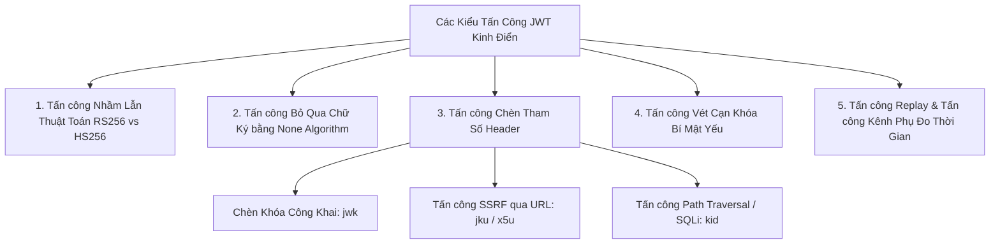
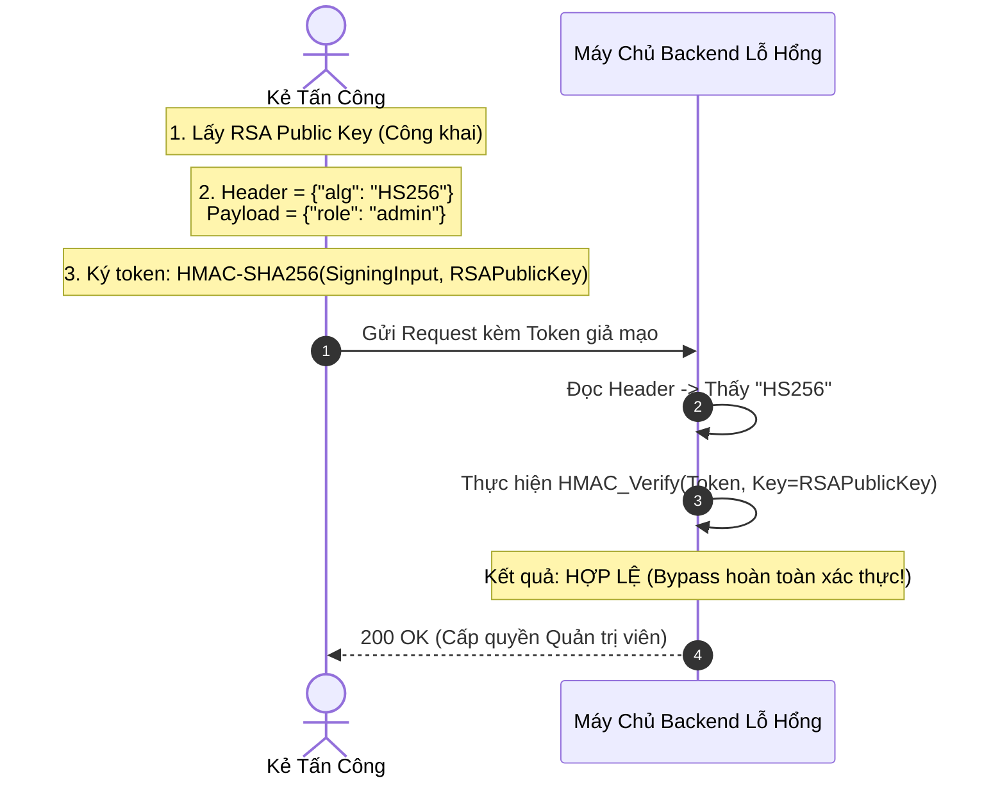
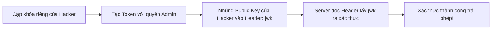

# Chương 5: Các Lỗ Hổng Bảo Mật Kinh Điển và Chiến Lược Phòng Thủ

JSON Web Token được sử dụng rộng rãi, nhưng việc cài đặt không đúng cách đã dẫn đến nhiều sự cố an ninh nghiêm trọng trong lịch sử phần mềm. Chương này phân tích chi tiết cơ chế kỹ thuật của từng loại hình tấn công và các giải pháp phòng ngự triệt để.



---

## 1. Lỗ Hổng Nhầm Lẫn Thuật Toán (Algorithm Confusion / Key Confusion - CVE-2015-9235)

### 1.1. Cơ chế tấn công

Lỗ hổng này xảy ra khi máy chủ backend tin tưởng một cách mù quáng vào trường `alg` do Client gửi lên trong Header mà không kiểm tra chế độ hoạt động thực tế đã cấu hình.

- **Kịch bản**: Backend được thiết kế để sử dụng thuật toán bất đối xứng RSA (`RS256`). Khóa công khai (Public Key) RSA của máy chủ được xuất bản công khai (hoặc dễ dàng trích xuất từ chứng chỉ SSL/TLS).
- **Hành vi khai thác của kẻ tấn công**:
  1. Kẻ tấn công lấy chuỗi khóa công khai RSA (định dạng PEM: `-----BEGIN PUBLIC KEY...`).
  2. Tạo một JWT giả mạo với Payload có quyền hạn cao (`{"role": "admin"}`).
  3. Sửa trường `alg` trong Header thành `HS256` (HMAC-SHA256).
  4. Sử dụng chính chuỗi Khóa công khai RSA làm **Secret Key** đối xứng để ký token bằng thuật toán HMAC.
  5. Gửi token giả mạo đến backend.
  6. Thư viện backend đọc thấy `alg: "HS256"`, chuyển sang gọi hàm `verify_hmac(token, key)`. Backend truyền biến chứa RSA Public Key vào tham số `key`. Do chữ ký được tạo bởi HMAC với đúng chuỗi byte của RSA Public Key đó, phép toán kiểm tra chữ ký trả về **TRUE**.



### 1.2. Biện pháp phòng thủ

- **Strict Algorithm Whitelisting**: Tuyệt đối không xác định thuật toán xác thực dựa vào giá trị trong Header của token. Thuật toán xác thực phải được ấn định cứng tại phía máy chủ hoặc giới hạn trong một danh sách cho phép nghiêm ngặt (Whitelist).
- **Tách biệt cấu trúc lưu trữ khóa (Key Store)**: Khóa RSA không bao giờ được phép truyền vào các hàm xử lý xác thực HMAC.

---

## 2. Lỗ Hổng Bỏ Qua Chữ Ký Bằng None Algorithm (`alg: "none"`)

### 2.1. Cơ chế tấn công

RFC 7518 định nghĩa thuật toán `none` cho các đối tượng JWS không cần chữ ký (Unsecured JWS). Một số thư viện JWT thế hệ cũ đã mắc sai lầm nghiêm trọng khi mặc định coi `alg: "none"` là hợp lệ và bỏ qua toàn bộ bước xác minh chữ ký.

- **Cách thức khai thác**:
  1. Kẻ tấn công lấy một token hợp lệ của tài khoản thường.
  2. Thay đổi nội dung Payload thành `{"user": "admin"}`.
  3. Thay đổi Header thành `{"alg": "none", "typ": "JWT"}` (hoặc các biến thể viết hoa/thường: `None`, `NONE`, `nOnE`).
  4. Xóa bỏ hoàn toàn phần Signature, chỉ để lại hai phần kèm dấu chấm ở cuối:
     `eyJhbGciOiJub25lIn0.eyJ1c2VyIjoiYWRtaW4ifQ.`
  5. Máy chủ chấp nhận token mà không cần bất kỳ khóa bí mật nào.

### 2.2. Biện pháp phòng thủ

- Mặc định vô hiệu hóa và từ chối mọi token có `alg: "none"`.
- Thư viện mật mã phải bắt buộc truyền khóa khi gọi hàm verify; nếu khóa được cung cấp mà token lại chứa `alg: "none"`, token phải bị ném lỗi và từ chối ngay lập tức.

---

## 3. Các Lỗ Hổng Chèn Tham Số Header (Header Parameter Injection)

### 3.1. Chèn Khóa Công Khai Trực Tiếp (`jwk` Header Injection)

- **Cơ chế**: RFC 7515 cho phép nhúng trực tiếp Public Key vào Header thông qua tham số `jwk`. Nếu backend lấy Public Key từ chính Header của token để kiểm tra chữ ký mà không kiểm tra độ tin cậy, kẻ tấn công chỉ cần tự tạo một cặp khóa riêng, ký token giả mạo và đính kèm Public Key của mình vào Header `jwk`.
- **Phòng thủ**: Chỉ chấp nhận các khóa từ danh sách JWKS tin cậy đã được cấu hình trước tại máy chủ; không bao giờ dùng khóa nằm trong Header `jwk` của token chưa được chứng thực.



---

## 3.2. Tấn Công SSRF và Nhiễm Độc Khóa Qua `jku` và `x5u`

- **Cơ chế**: Tham số `jku` (JWK Set URL) và `x5u` (X.509 URL) chỉ định đường dẫn URL để tải về Public Key. Kẻ tấn công có thể trỏ URL về máy chủ do chúng kiểm soát (`https://attacker.com/jwks.json`) để máy chủ backend tải khóa giả mạo, hoặc kích hoạt lỗ hổng Server-Side Request Forgery (SSRF) tấn công các dịch vụ nội bộ (`http://169.254.169.254/` hoặc `http://localhost:8080/admin`).
- **Phòng thủ**:
  - Thiết lập danh sách trắng (Whitelist) nghiêm ngặt các domain được phép tải JWKS.
  - Vô hiệu hóa tính năng tự động tải khóa từ URL do Client cung cấp.

---

## 3.3. Thao Túng Mã Khóa (`kid` Manipulation): Path Traversal và SQL Injection

- **Cơ chế**:
  - **Path Traversal**: Nếu backend dùng `kid` để đọc file khóa trên hệ điều hành: `File.read("/var/keys/" + header.kid)`. Kẻ tấn công đặt `kid: "../../../dev/null"` (file rỗng, khi đó chuỗi bí mật HMAC trở thành chuỗi rỗng có thể đoán trước).
  - **SQL Injection**: Nếu backend truy vấn khóa từ Database bằng câu lệnh: `SELECT secret FROM keys WHERE id = '` + `header.kid` + `'`. Kẻ tấn công chèn cú pháp SQLi để trích xuất khóa hoặc ép câu lệnh trả về giá trị cố định.
- **Phòng thủ**: Sử dụng Parameterized Query (Prepared Statement), lọc chặt chẽ các ký tự trong `kid` (chỉ cho phép ký tự chữ và số, giới hạn độ dài).

---

## 4. Tấn Công Vét Cạn Khóa Bí Mật Yếu (Weak Secrets Brute-Force)

### 4.1. Cơ chế tấn công ngoại tuyến (Offline Attack)

Do chuỗi JWT được lưu trữ và truyền tải phía Client, bất kỳ ai có được token đều có thể thực hiện tấn công Brute-force ngoại tuyến mà không cần gửi bất kỳ request nào đến máy chủ ứng dụng.

```text
Signing Input: eyJhbGciOiJIUzI1NiJ9.eyJzdWIiOiIxMjM0NTY3ODkwIn0
Signature:     qX-s_oXzX-c00Z88l_z6J6g1_0k_lXb8q...
```

Kẻ tấn công sử dụng các công cụ chuyên dụng như **Hashcat** (Mode 16500 - `JWT (JSON Web Token)`) hoặc **John the Ripper** tận dụng sức mạnh tính toán song song của dàn GPU để thử hàng tỷ mật khẩu mỗi giây dựa trên các bộ từ điển rò rỉ như `rockyou.txt`.

### 4.2. Biện pháp phòng thủ

- Sử dụng khóa bí mật có độ hỗn loạn cao (High Entropy), được tạo từ bộ sinh số ngẫu nhiên mật mã học an toàn (CSPRNG).
- Độ dài khóa đối xứng HS256 bắt buộc tối thiểu 256 bits (32 bytes ngẫu nhiên) hoặc chuyển sang sử dụng khóa bất đối xứng (RSA/ECDSA/EdDSA).

---

## 5. Tấn Công Replay và Thách Thức Thu Hồi Token (Revocation)

### 5.1. Bản chất vấn đề

JWT có bản chất là phi trạng thái (Stateless). Khi một token hợp lệ đã được phát hành và chưa hết hạn (`exp`), bất kỳ ai nắm giữ token đó đều có thể gửi request hợp lệ tới hệ thống.

### 5.2. Giải pháp kỹ thuật

1. **Short-lived Access Tokens**: Đặt thời gian sống của Access Token cực ngắn (từ 5 đến 15 phút).
2. **Token Blacklist / Blocklist**: Lưu trữ các mã `jti` (JWT ID) bị thu hồi trên bộ nhớ đệm phân tán Redis với TTL bằng đúng thời gian sống còn lại của token.
3. **Session Versioning**: Lưu trường `token_version` trong bảng người dùng tại cơ sở dữ liệu. Khi người dùng đổi mật khẩu hoặc Đăng xuất khỏi mọi thiết bị, tăng `token_version` lên 1 đơn vị. Máy chủ API kiểm tra claim này để từ chối các token cũ.

---

## 6. Tấn Công Kênh Phụ Đo Lường Thời Gian (Timing Attacks on Signature Verification)

### 6.1. Cơ chế tấn công

Khi so sánh chữ ký nhận được từ token với chữ ký tính toán được, nếu sử dụng các toán tử so sánh chuỗi thông thường (như `==` hoặc `strcmp`), thuật toán sẽ dừng lại ngay khi phát hiện byte đầu tiên không khớp:

```rust
// NGUY HIỂM: So sánh không hằng số thời gian (Variable-time comparison)
fn insecure_compare(a: &[u8], b: &[u8]) -> bool {
    if a.len() != b.len() { return false; }
    for i in 0..a.len() {
        if a[i] != b[i] { return false; } // Dừng sớm -> Làm lộ thông tin thời gian
    }
    true
}
```

Kẻ tấn công đo độ trễ phản hồi của mạng (tính bằng nano-giây) qua nhiều lần thử để đoán chính xác từng byte của chữ ký hợp lệ.

### 6.2. Biện pháp phòng thủ

Sử dụng hàm so sánh hằng số thời gian (Constant-time comparison) để đảm bảo thời gian thực thi luôn không đổi bất kể chuỗi khớp ở vị trí nào:

```rust
// AN TOÀN: So sánh hằng số thời gian (Constant-time comparison)
use subtle::ConstantTimeEq;

fn secure_compare(a: &[u8], b: &[u8]) -> bool {
    a.ct_eq(b).into()
}
```
