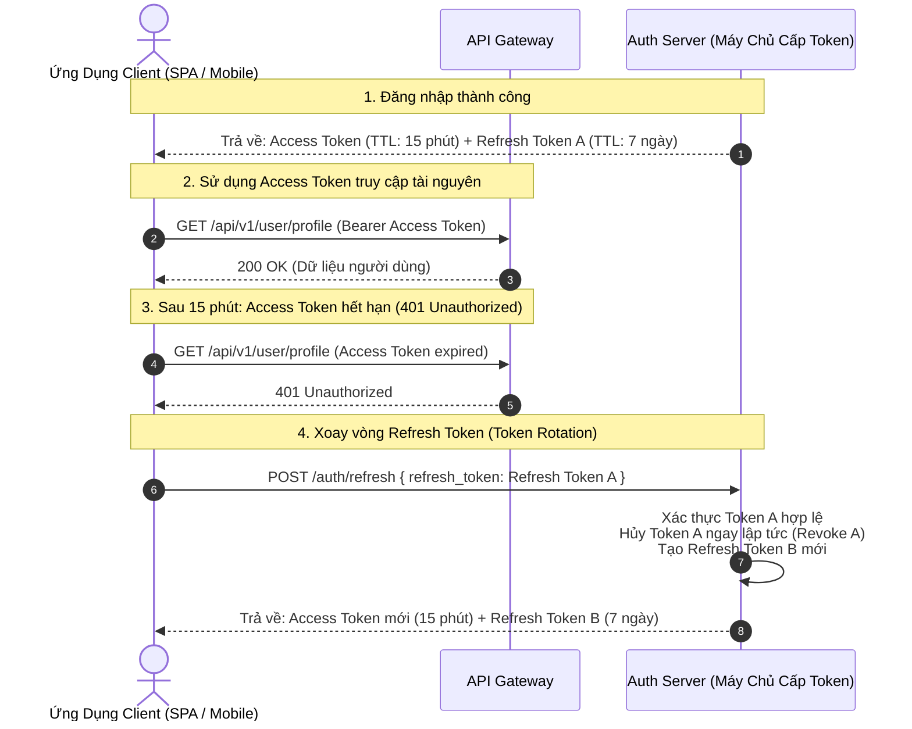
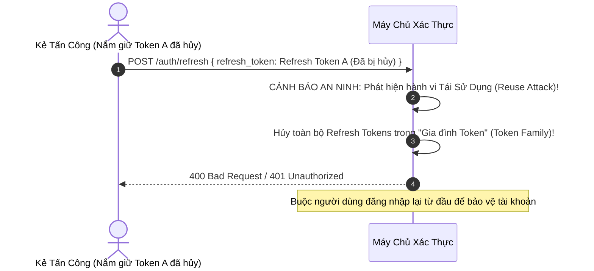
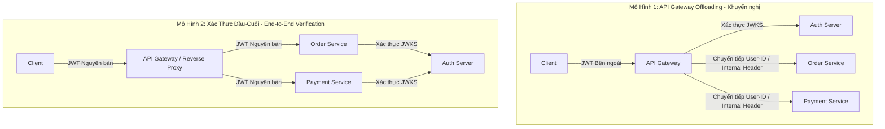

# Chương 6: Best Practices và Kiến Trúc Triển Khai Thực Tế

Chương này tổng hợp các mô hình thiết kế hệ thống chuẩn công nghiệp, các kiến trúc xác thực cấp Enterprise và những nguyên tắc vàng khi vận hành JWT trong môi trường Production.

---

## 1. Mô Hình Access Token Ngắn Hạn và Refresh Token Rotation (RTR)

Mô hình hai lớp token (Dual-Token Pattern) kết hợp cơ chế xoay vòng Refresh Token (Refresh Token Rotation) là tiêu chuẩn vàng để cân bằng giữa tính thuận tiện phi trạng thái và năng lực kiểm soát an ninh.



### 1.1. Cơ Chế Phát Hiện Tái Sử Dụng Refresh Token (Reuse Detection)

Nếu kẻ tấn công đánh cắp được `Refresh Token A` và cố tình gửi lên máy chủ sau khi Client hợp lệ đã thực hiện xoay vòng khóa (tức là Token A đã nằm trong danh sách hủy):



Khi phát hiện một token đã bị thu hồi được sử dụng lại, máy chủ xác thực lập tức hủy toàn bộ "Gia đình token" (Token Family) liên quan đến phiên làm việc đó, buộc tất cả các phiên đăng nhập phải xác thực lại bằng mật khẩu và xác thực đa yếu tố (MFA).

---

## 2. Mô Hình Kiến Trúc Xác Thực Trong Hệ Sinh Thái Microservices

Có hai kiến trúc phổ biến để xử lý JWT trong hệ thống Microservices:



### So sánh hai mô hình

1. **API Gateway Offloading (Mô hình 1 - Khuyến nghị)**:
   - API Gateway đóng vai trò làm lá chắn trung tâm: giải mã token, xác thực chữ ký, kiểm tra thời hạn và tra cứu danh sách chặn (Blacklist).
   - Sau khi xác thực thành công, Gateway trích xuất các claims cần thiết và chuyển tiếp qua HTTP Header nội bộ (ví dụ: `X-User-Id: 12345`, `X-User-Roles: admin`) hoặc tạo một Internal JWT có thời gian sống siêu ngắn (khoảng 30 giây).
   - **Ưu điểm**: Các service nội bộ không cần cài đặt logic mật mã phức tạp, giảm tải xử lý CPU và giảm thiểu độ trễ mạng.

2. **Xác thực Đầu-Cuối (End-to-End JWT Propagation - Mô hình 2)**:
   - Chuỗi JWT được giữ nguyên vẹn và chuyển tiếp qua từng tầng dịch vụ.
   - **Ưu điểm**: Triệt để tuân thủ nguyên tắc Không Tin Cậy (Zero-Trust), mỗi dịch vụ tự chịu trách nhiệm kiểm tra quyền hạn.
   - **Nhược điểm**: Tăng tải tính toán mật mã học trên toàn bộ các service; đòi hỏi tất cả service phải đồng bộ cơ chế cache JWKS.

---

## 3. Xử Lý Lệch Đồng Hồ Phân Tán (Clock Skew và Leeway)

Trong các hệ thống phân tán, đồng hồ phần cứng giữa máy chủ phát hành token (Identity Provider) và máy chủ tài nguyên (Resource Server) có thể bị lệch nhau một vài giây hoặc vài chục giây dù đã đồng bộ qua giao thức NTP (Network Time Protocol).

### 3.1. Thiết lập khoảng dung sai (Leeway Tolerance Window)

Để tránh việc token hợp lệ bị từ chối oan khi vừa mới tạo (`nbf` hoặc `iat` nằm ở tương lai của Resource Server) hoặc vừa mới hết hạn vài mili-giây, bắt buộc phải cấu hình cửa sổ dung sai thời gian (Leeway).

```text
Thời điểm hiện tại trên Resource Server: T

Điều kiện kiểm tra chuẩn (không có leeway):
  iat <= T
  nbf <= T
  exp > T

Điều kiện kiểm tra an toàn kèm Leeway (Delta = 30-60 giây):
  iat <= T + Delta
  nbf <= T + Delta
  exp > T - Delta
```

- **Giá trị Leeway khuyến nghị**: Từ `30` đến `60` giây.
- **Cảnh báo an ninh**: Tuyệt đối không cấu hình Leeway quá dài (ví dụ: 10–15 phút), vì điều này sẽ vô tình kéo dài thời gian sống thực tế của token sau khi hết hạn.

---

## 4. Chiến Lược Lưu Trữ Token An Toàn Phía Client

| Nền tảng | Phương thức lưu trữ | Đánh giá an ninh | Cơ chế bảo vệ |
| :--- | :--- | :--- | :--- |
| **Trình duyệt Web (SPA)** | In-Memory (Biến JavaScript) + Refresh Token lưu trong Cookie `HttpOnly`, `Secure`, `SameSite=Strict` | **Tối ưu nhất** | Ngăn chặn mã độc XSS đánh cắp Refresh Token, loại bỏ nguy cơ CSRF nhờ cờ SameSite. |
| **Trình duyệt Web (SPA)** | `localStorage` hoặc `sessionStorage` | **Rủi ro cao** | Bất kỳ lỗ hổng XSS nào cũng có thể đọc và gửi trộm toàn bộ token về máy chủ kẻ tấn công. |
| **Ứng dụng Di động (iOS)** | iOS Keychain Services | **Tiêu chuẩn cao** | Dữ liệu được mã hóa phần cứng bởi Secure Enclave của thiết bị Apple. |
| **Ứng dụng Di động (Android)** | Android Keystore / EncryptedSharedPreferences | **Tiêu chuẩn cao** | Dữ liệu được bảo vệ an toàn trong môi trường phần cứng tin cậy TEE (Trusted Execution Environment). |

---

## 5. Nguyên Tắc Tối Ưu Hóa Kích Thước và Quản Lý Claims

1. **Tuyệt đối không lưu trữ dữ liệu nhạy cảm trong Payload**:
   - JWT chỉ được ký số để bảo vệ tính toàn vẹn (JWS), **HOÀN TOÀN KHÔNG MÃ HÓA NỘI DUNG**. Bất kỳ ai bắt được token đều có thể giải mã Base64URL để xem toàn bộ nội dung. Tuyệt đối không đưa: Mật khẩu, mã PIN, số thẻ tín dụng, thông tin định danh cá nhân nhạy cảm (PII).

2. **Tối ưu hóa độ dài tên trường và kích thước Payload**:
   - HTTP Header có giới hạn kích thước tiếp nhận (thường từ 8KB đến 16KB tùy cấu hình Nginx/Apache/Cloudflare).
   - Sử dụng tên trường ngắn gọn (ví dụ: `uid` thay vì `user_identifier_long_name`).

3. **Luôn kiểm tra đầy đủ bộ ba Claims cơ bản**:
   - `iss` (Issuer): Đảm bảo token xuất phát từ đúng máy chủ xác thực tin cậy của tổ chức.
   - `aud` (Audience): Đảm bảo token được cấp phát cho đúng dịch vụ API hiện tại, ngăn ngừa việc mang token của dịch vụ A sang gọi API của dịch vụ B.
   - `exp` (Expiration Time): Bắt buộc mọi token đều phải có thời hạn sử dụng rõ ràng.
