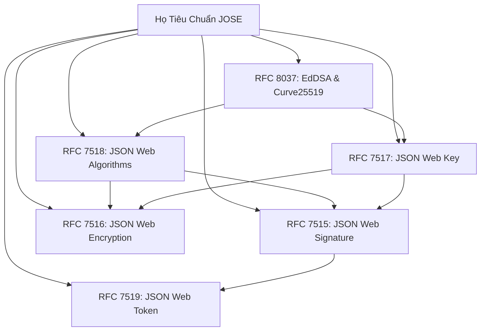

# Tài Liệu Chuyên Sâu Về JSON Web Token (JWT) và Hệ Sinh Thái JOSE

Tài liệu này cung cấp cái nhìn toàn diện, chuẩn mực học thuật và thực tiễn kỹ thuật về **JSON Web Token (JWT)**, cơ chế chữ ký số **JSON Web Signature (JWS)**, định dạng khóa **JSON Web Key (JWK/JWKS)** và các tiêu chuẩn bảo mật trong hệ sinh thái **JOSE (Javascript Object Signing and Encryption)**.

---

## Mục Lục Tài Liệu

1. [Chương 1: Tổng Quan và Kiến Trúc Xác Thực](01-tong-quan-va-kien-truc.md)
   - Lịch sử tiến hóa: Stateful Session vs Stateless Token
   - Định nghĩa và vị trí của JWT trong kiến trúc hiện đại
   - Phân biệt bản chất: JWT, JWS và JWE
   - Ưu điểm và nhược điểm khi áp dụng JWT trong hệ thống phân tán

2. [Chương 2: Cấu Trúc Phân Đoạn và Mã Hóa Base64URL](02-cau-truc-va-ma-hoa-base64url.md)
   - Giải phẫu 3 thành phần: Header, Payload, Signature
   - Các tham số tiêu chuẩn trong JOSE Header
   - Phân loại Claims: Registered, Public và Private Claims
   - Thuật toán mã hóa Base64URL (RFC 4648) và tại sao không dùng Base64 chuẩn
   - Công thức toán học tạo chuỗi ký (Signing Input)

3. [Chương 3: Các Thuật Toán Ký Số JWA (RFC 7518 & RFC 8037)](03-cac-thuat-toan-ky-jwa.md)
   - Thuật toán đối xứng HMAC-SHA (HS256, HS384, HS512)
   - Thuật toán bất đối xứng RSA PKCS#1 v1.5 vs RSA-PSS (RS256 vs PS256)
   - Thuật toán đường cong Elliptic ECDSA (ES256, ES384, ES512 - Chuẩn IEEE P1363 vs ASN.1 DER)
   - Thuật toán Edwards-curve EdDSA (Ed25519 - RFC 8037)
   - Bảng so sánh toàn diện: Kích thước khóa, kích thước chữ ký, tốc độ tính toán và mức độ an toàn

4. [Chương 4: Tiêu Chuẩn Quản Lý Khóa JWK và JWKS (RFC 7517)](04-tieu-chuan-jwk-va-jwks.md)
   - Cấu trúc dữ liệu JSON Web Key (JWK) cho RSA, EC, OKP, Oct
   - Tập hợp khóa JSON Web Key Set (JWKS)
   - Cơ chế OIDC Discovery và tự động phân giải khóa qua `/.well-known/jwks.json`
   - Quy trình xoay vòng khóa không gián đoạn dịch vụ (Zero-Downtime Key Rotation)
   - Chiến lược lưu bộ nhớ đệm (Caching) và phòng chống tấn công từ chối dịch vụ (DoS)

5. [Chương 5: Các Lỗ Hổng Bảo Mật Kinh Điển và Chiến Lược Phòng Thủ](05-cac-lo-hong-bao-mat-kinh-dien.md)
   - Tấn công nhầm lẫn thuật toán (Algorithm Confusion Attack - CVE-2015-9235)
   - Khai thác bỏ qua chữ ký với thuật toán None (`alg: none`)
   - Tấn công chèn tham số Header: `jwk` injection, `jku`/`x5u` SSRF, `kid` Path Traversal / SQLi
   - Tấn công vét cạn khóa bí mật yếu (Weak Secret Brute-Force với Hashcat/John the Ripper)
   - Rủi ro Replay Attack và bài toán thu hồi token (Revocation)
   - Tấn công kênh phụ đo lường thời gian (Timing Attack) và kỹ thuật so sánh hằng số thời gian (Constant-time comparison)

6. [Chương 6: Best Practices và Kiến Trúc Triển Khai Thực Tế](06-best-practices-va-chuan-trien-khai.md)
   - Mô hình Access Token ngắn hạn kết hợp Refresh Token Rotation (RTR) và Reuse Detection
   - Kiến trúc xác thực trong Microservices: API Gateway Offloading vs End-to-End Verification
   - Xử lý lệch đồng hồ phân tán (Clock Skew) và thiết lập khoảng dung sai (Leeway)
   - Chiến lược lưu trữ an toàn trên Client: In-Memory / HttpOnly Cookie vs LocalStorage
   - Nguyên tắc tối ưu hóa kích thước Payload và khử trùng dữ liệu Claims

7. [Chương 7: Sổ Tay Thực Chiến và Kiểm Thử với jwt-debugger CLI](07-so-tay-thuc-chien-jwt-debugger.md)
   - Sổ tay tra cứu nhanh các lệnh của công cụ `jwt-debugger`
   - Giải mã và kiểm tra cấu trúc chuyên sâu
   - Xác thực chữ ký đa thuật toán (HMAC, RSA, ECDSA, Ed25519, Remote JWKS)
   - Sinh cặp khóa mật mã học (PEM, JWK, JWKS)
   - Ký và ban hành token mới
   - Tích hợp kiểm thử tự động trong CI/CD Pipeline (GitHub Actions, GitLab CI)

---

## Bản Đồ Hệ Sinh Thái Tiêu Chuẩn JOSE

---

## Bảng Tra Cứu Các Đặc Tả Tiêu Chuẩn IETF

| Tiêu chuẩn | Tên tài liệu đặc tả | Trạng thái | Mục đích cốt lõi |
| :--- | :--- | :--- | :--- |
| **RFC 7519** | JSON Web Token (JWT) | Chuẩn đề xuất (Standards Track) | Định dạng đại diện cho các tập hợp xác nhận (claims) truyền tải an toàn giữa các bên dưới dạng đối tượng JSON. |
| **RFC 7515** | JSON Web Signature (JWS) | Chuẩn đề xuất (Standards Track) | Cơ chế tạo chữ ký số hoặc mã xác thực thông điệp (MAC) bảo vệ tính toàn vẹn của dữ liệu JSON. |
| **RFC 7516** | JSON Web Encryption (JWE) | Chuẩn đề xuất (Standards Track) | Cơ chế mã hóa đảm bảo tính bí mật cho nội dung dữ liệu JSON. |
| **RFC 7517** | JSON Web Key (JWK) | Chuẩn đề xuất (Standards Track) | Cấu trúc dữ liệu JSON biểu diễn các khóa mật mã học (khóa công khai, khóa bí mật, tập hợp khóa JWKS). |
| **RFC 7518** | JSON Web Algorithms (JWA) | Chuẩn đề xuất (Standards Track) | Danh mục chuẩn hóa các thuật toán mật mã học sử dụng trong JWS, JWE và JWK. |
| **RFC 8037** | CFRG ECDH and Signatures in JOSE | Chuẩn đề xuất (Standards Track) | Bổ sung các đường cong Edwards (Ed25519, Ed448) và Montgomery (X25519, X448) vào JOSE. |
| **RFC 8725** | JSON Web Token Best Current Practices | Thực tiễn chuẩn (BCP 225) | Tập hợp các khuyến nghị an ninh và hướng dẫn phòng chống lỗ hổng bảo mật khi triển khai JWT. |

---

## Lộ Trình Tiếp Cận Theo Vai Trò Kỹ Thuật

- **Lập trình viên Backend (Backend Developer)**: Tập trung vào [Chương 1](01-tong-quan-va-kien-truc.md), [Chương 2](02-cau-truc-va-ma-hoa-base64url.md), [Chương 6](06-best-practices-va-chuan-trien-khai.md).
- **Kỹ sư An toàn Thông tin (Security Engineer / Pentester)**: Tập trung vào [Chương 3](03-cac-thuat-toan-ky-jwa.md), [Chương 4](04-tieu-chuan-jwk-va-jwks.md), [Chương 5](05-cac-lo-hong-bao-mat-kinh-dien.md).
- **Kiến trúc sư Hệ thống (Solution Architect)**: Tập trung vào [Chương 1](01-tong-quan-va-kien-truc.md), [Chương 4](04-tieu-chuan-jwk-va-jwks.md), [Chương 6](06-best-practices-va-chuan-trien-khai.md).
- **Kỹ sư DevOps / SRE**: Tập trung vào [Chương 4](04-tieu-chuan-jwk-va-jwks.md), [Chương 7](07-so-tay-thuc-chien-jwt-debugger.md).
